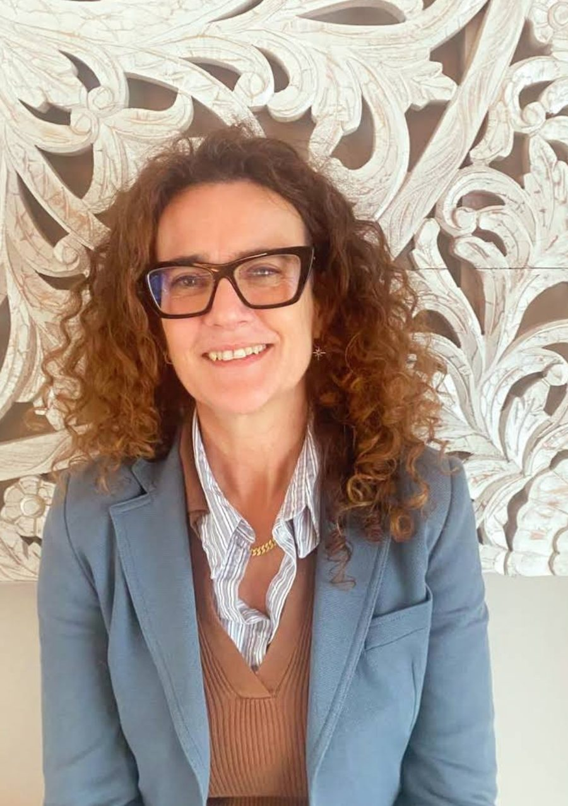

# Psicoterapia Lidia Simonetta — sito web

Sito vetrina per la Dott.ssa Lidia Simonetta Biacchi, psicoterapeuta a
orientamento sistemico-relazionale (studio a Macherio/Monza, MB).

## Stack tecnico

Sito statico puro: HTML + CSS + JS vanilla, **nessuna build, nessuna
dipendenza npm**. Si pubblica così com'è su qualsiasi hosting statico
(GitHub Pages, Netlify, Cloudflare Pages, ecc.).

Per vedere il sito in locale basta apririe `index.html` nel browser, oppure:

```bash
python3 -m http.server 8000
```

## Struttura

```
index.html          → homepage in italiano (lingua principale)
en/index.html        → homepage in inglese (stessa struttura, contenuti tradotti)
assets/css/style.css → unico foglio di stile, condiviso dalle due pagine
assets/js/main.js    → menu mobile, animazioni di apparizione, anno footer
assets/img/          → icone e illustrazioni SVG (vedi sotto)
```

Le due pagine (`index.html` e `en/index.html`) hanno **la stessa struttura
e gli stessi id di sezione** (`#about`, `#services`, `#how-it-works`,
`#safe-space`, `#location`, `#contact`). Se modifichi una sezione in una
lingua, replica la modifica (struttura/stile, non necessariamente il testo)
nell'altra pagina.

## Design system (in `assets/css/style.css`, sezione `:root`)

Palette calda e accogliente:

- `--cream` / `--cream-soft` — sfondi
- `--terracotta` / `--terracotta-dark` — colore primario (CTA, link, accenti)
- `--sage` / `--sage-light` — colore secondario
- `--brown` / `--brown-light` — testo
- `--gold` — accenti decorativi

Tipografia: **Fraunces** (titoli, serif caldo) + **Mulish** (testo, sans
pulito), caricati da Google Fonts.

## Foto reali

Al momento le sezioni "Chi sono" (hero/about) e "Dove sono" (studio) usano
dei **placeholder fotografici** (`.photo-placeholder` in `style.css`):
riquadri con icona + didascalia che indicano quale immagine andrebbe
inserita.

Per sostituirli con foto vere:

1. Aggiungi il file in `assets/img/` (consigliato: `ritratto-lidia.jpg` —
   ritratto quadrato/verticale, min. 800×1000px; `studio-1.jpg`,
   `studio-2.jpg` — foto dello studio, 1200×900px).
2. Sostituisci il `<div class="photo-placeholder ...">...</div>`
   corrispondente con `` (la classe `.photo` applica già angoli arrotondati e
   ombra coerenti col design).
3. Ripeti la modifica in entrambe le pagine (IT e EN), aggiornando l'`alt`
   nella lingua corretta.

## Icone/illustrazioni SVG

In `assets/img/`: icone lineari nei colori della palette (cuore, persone,
famiglia, valigetta, scudo, foglia) e un'illustrazione hero. Sono file SVG
statici con colori hardcoded coerenti con la palette — se cambi la palette
in CSS, aggiorna anche i colori `fill`/`stroke` in questi SVG.

## Dati di contatto (fonte di verità)

- Nome: Dott.ssa Lidia Simonetta Biacchi
- Telefono / WhatsApp: +39 338 119 4532
- Email: lalidiasimonetta@hotmail.com
- Indirizzo studio: Via Vincenzo Bellini, 25, 20846 Macherio (MB), Italia
- Numero Albo / iscrizione Ordine Psicologi: **da inserire** — è presente
  un placeholder `[N. iscrizione Albo Psicologi ...]` nel footer di
  entrambe le pagine, da completare con i dati reali.

Se questi dati cambiano, aggiornali in **entrambe** le pagine (header
contatti, sezione `#contact`, footer, e nel link mappa/WhatsApp).

## Note di contenuto

- Tono: caldo, accogliente, rassicurante, professionale — mai clinico o
  freddo.
- La sezione "Uno spazio sicuro" richiama la riservatezza e il segreto
  professionale: è la sezione "trust & safety" del sito, da non rimuovere.
- Nessun modulo di contatto con backend: i contatti avvengono via
  telefono, WhatsApp ed email (link diretti `tel:`, `https://wa.me/...`,
  `mailto:`).
